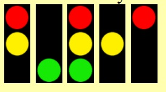

# Vytvorte program Pokazený semafor. Na križovatke sa pokazil semafor (obsahuje červenú, žltú a zelenú farbu). 
Teraz na ňom v pravidelných časových intervaloch svietia rôzne svetlá takto:
- niekedy svietia všetky tri svetlá,
- niekedy svieti len zelené alebo len žlté, alebo len červené svetlo,
- niekedy svieti naraz červené a žlté svetlo.

Ukážka všetkých možností je na obrázkoch:



## Riešenie:
``` python
import tkinter as tk
from random import randint

c = tk.Canvas()
c.pack()

radius = 26

c.create_rectangle(10, 20, 40, 120, fill='black')
c.create_oval(12, 22, 12 + radius, 22 + radius, fill='red', width=0, state='normal', tags='r')
c.create_oval(12, 22 + radius + 8, 12 + radius, 22 + (radius * 2) + 8, fill='yellow', width=0, state='normal', tags='y')
c.create_oval(12, 22 + (radius * 2) + 16, 12 + radius, 22 + (radius * 3) + 16, fill='green', width=0, state='normal',
              tags='g')


def svetlo():
    x = randint(0, 4)
    if x == 0:
        c.itemconfig('r', state='normal')
        c.itemconfig('y', state='hidden')
        c.itemconfig('g', state='hidden')
    elif x == 1:
        c.itemconfig('r', state='hidden')
        c.itemconfig('y', state='normal')
        c.itemconfig('g', state='hidden')
    elif x == 2:
        c.itemconfig('r', state='hidden')
        c.itemconfig('y', state='hidden')
        c.itemconfig('g', state='normal')
    elif x == 3:
        c.itemconfig('r', state='normal')
        c.itemconfig('y', state='normal')
        c.itemconfig('g', state='normal')
    elif x == 4:
        c.itemconfig('r', state='normal')
        c.itemconfig('y', state='normal')
        c.itemconfig('g', state='hidden')
    c.after(1000, svetlo)


svetlo()

tk.mainloop()
```