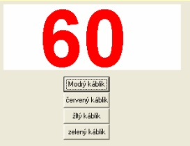

# Vytvorte program Pyrotechnik.
- Veľkými číslami sa na ploche odpočítavajú sekundy (napr. od 60 do 0) a v časovom limite treba prestrihnúť správny káblik, aby nevybuchla bomba. 
- Program má štyri tlačidlá – modrý, žltý, zelený, červený káblik. Kliknutie na tlačidlo znamená, že sme sa rozhodli prestrihnúť daný káblik.
- Počítač po spustení náhodne vyberie správny káblik a zapamätá si ho. Hráč ho musí v časovom limite stlačiť (prestrihnúť).
- Sú dve možnosti riešenia – ak nestlačí včas správny káblik, napíše sa „Bomba vybuchla“ a nemôže stlačiť nič iné, alebo môže stláčať aj iné kábliky, kým bombu nezničí.

