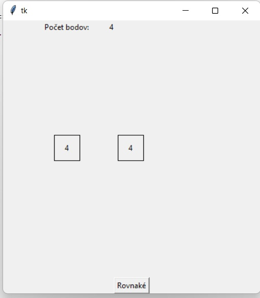

# Vytvorte hru rovnaké kocky. 
- V hre sa zobrazujú náhodné hodnoty dvoch hracích kociek (1 - 6).
- Hodnoty sa v pravidelných intervaloch menia. 
- Úlohou hráča je zatlačiť tlačidlo „Rovnaké“, ak sú na oboch kockách rovnaké hodnoty. 
- Ak stlačil tlačidlo v správnom okamihu, pripočítajú sa mu dva body. 
- Keď sú hodnoty na kockách rôzne, hráč stratí jeden bod. 
- V hornej časti obrazovky sa vypisuje aktuálny bodový stav.

