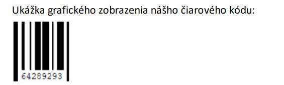

# Vytvorte program Čiarový kód, ktorý z textového súboru prečíta čiarový kód a vykreslí ho na obrazovku.
Náš čiarový kód obsahuje osemciferné čísla, ktoré nezačínajú nulou. Každá číslica je znázornená čiarou, ktorej hrúbka je rovná hodnote číslice (napr. číslica 4 bude zobrazená čiarou s hrúbkou 4). Čiary sú dlhé 80 bodov a sú od seba rovnako vzdialené (priestor pre každú čiaru má šírku 10 pixelov). Medzi prvou a poslednou čiarou je zobrazený aj číselný kód, teda druhá až siedma čiara nezasahujú do číselného kódu. 
