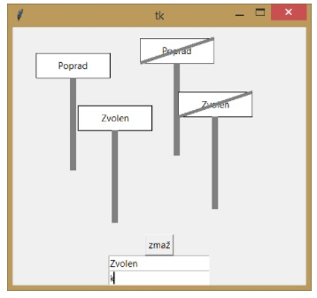

ytvorte program, v ktorom môžeme kresliť na mieste kliknutia myši značku začiatku alebo konca obce/mesta. 
V programe sú dve súčiastky entry. 
Do jednej zadávame názov obce a do druhej zadávame, či sa má nakresliť značka začiatku alebo konca. 
Keď do druhého entry napíšeme písmeno k, nakreslí sa značka konca obce - bude prečiarknutá. 
V programe bude aj tlačidlo, ktoré zmaže grafickú plochu. Značku nakreslite podľa obrázku:

