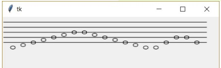

Vytvorte program, ktorý bude kresliť noty (celé) na notovej osnove nasledovne: 
na ploche sa nakreslí notová osnova, 
v textovom súbore noty.txt je v jednom riadku uložená postupnosť nôt (použité sú len tieto: c, d, e, f, g, a, h) – program prečíta prvú notu a zobrazí ju na osnove, 
postupne prečíta všetky noty a zapíše ich na osnovu, 

Ukážka textového súboru: cdefgahcdahdecdefgahhagfdec

Napríklad pre postupnosť cdefgahhagfed sa nakreslí:

