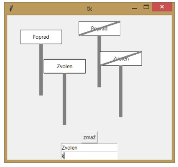

#  1. [Pero](01) 

Naprogramujte pohyb grafického pera určeným smerom, ktorý za sebou zanecháva čiaru. 
Na začiatku má nastavený smer na sever. Smer pohybu meníme pomocou klávesnice (resp. tlačidiel) v štyroch základných 
smeroch (hore, dole, vpravo, vľavo).
```python:01/01.py

```

---

# 2. [Násobilka](02)
Vytvorte program, ktorý vyskúša mladšieho súrodenca z malej násobilky.

##### Program bude mať tieto vlastnosti:

* Program vygeneruje 10 príkladov na násobenie jednociferných čísel
* a zapíše ich do textového súboru.
* Príklady nám postupne zadáva v textovom režime a prečíta našu odpoveď.
* Za správnu odpoveď získame 1 bod, ak odpovieme nesprávne 0 bodov.
* Po skončení riešenia program vypíše počet získaných bodov.

---

# 3. [Háďa](03)
V textovom súbore hada.txt máme zapísaný priebeh hier „Háďa". V
    každom riadku je zapísaný priebeh jednej hry. V riadku sú znaky,
    ktoré reprezentujú smer pohybu Háďaťa (H - hore, D - dole, L -
    vľavo, P - vpravo). Jeden znak symbolizuje jeden krok v danom smere.
    Napríklad: HHHHDDDDDDLLLLLLLDH.

##### Ukážka textového súboru:

* HHHHDDDDDDLLLLLLLDH
* HHHHHHHHHHHHHHHHHHHHHHLLLLLLLLLLLLLLLLLDDDDDDDDDDDDDDDPPPPPPPPPP
* HHHHHHHHHLLLLLLLLLLLLLLLLLDDDDDDDDDDDDDDDPPPPPPPPPP

##### Vytvorte program, ktorý:

* zistí počet zapísaných hier v súbore,
* zistí, koľko krokov mala najdlhšia hra,
* vytvorí kópiu textového súboru.

---

# 4. [Kalkulačka](04)
##### Vytvorte program ktorý na displeji zobrazí číslo stlačené na tlačidle.


---

# 5. [Semafor](05)

##### Vytvorte program Pokazený semafor.
Na križovatke sa pokazil semafor (obsahuje červenú, žltú a zelenú farbu). Teraz na ňom v pravidelných
    časových intervaloch svietia rôzne svetlá takto:

-   niekedy svietia všetky tri svetlá,
-   niekedy svieti len zelené alebo len žlté, alebo len červené svetlo,
-   niekedy svieti naraz červené a žlté svetlo.

Ukážka všetkých možností je na obrázku:


---
# 6. [Pyrotechnik](06)

#####  Vytvorte program Pyrotechnik

Veľkými číslami sa na ploche odpočítavajú sekundy (napr. od 60 do 0)
    a v časovom limite treba prestrihnúť správny káblik, aby nevybuchla
    bomba.\
Program má štyri tlačidlá -- modrý, žltý, zelený, červený
    káblik. Kliknutie na tlačidlo znamená, že sme sa rozhodli
    prestrihnúť daný káblik.\
    Počítač po spustení náhodne vyberie správny káblik a zapamätá si ho.
    Hráč ho musí v časovom limite stlačiť (prestrihnúť).\
    Sú dve možnosti riešenia -- ak nestlačí včas správny káblik, napíše
    sa „Bomba vybuchla" a nemôže stlačiť nič iné, alebo môže stláčať aj
    iné kábliky, kým bombu nezničí.


---

# 7. [Rovnaké kocky](07)
##### Vytvorte hru rovnaké kocky.

V hre sa zobrazujú náhodné hodnoty dvoch hracích kociek (1 - 6). Hodnoty
sa v pravidelných intervaloch menia. Úlohou hráča je zatlačiť tlačidlo
„Rovnaké", ak sú na oboch kockách rovnaké hodnoty. Ak stlačil tlačidlo v
správnom okamihu, pripočítajú sa mu dva body. Keď sú hodnoty na kockách
rôzne, hráč stratí jeden bod. V hornej časti obrazovky sa vypisuje
aktuálny bodový stav.


---

8.  Vytvorte program -- „šetrič obrazovky", ktorý:

-   nám umožňuje pomocou súčiastky Entry zadávať ľubovoľný text,

-   v pravidelných intervaloch zobrazuje zadaný text na náhodnom mieste
    a náhodnou farbou zo zadaných možností,

-   zadaný text v každom ďalšom zobrazení nakreslí otočený s väčším
    uhlom,

-   text vykresľuje postupne iba s uhlami otočenia od 10 do 90 a potom
    znovu od začiatku s uhlom 10 až 90,

-   pri kliknutí na plochu obsah obrazovky zmaže.

9.  Vytvorte program Titulky do televízie, ktorý:

-   bude v pravidelných intervaloch kresliť na obrazovke text zadaný v
    Entry,

-   bude text postupne posúvať z pravého dolného okraja obrazovky k
    ľavému dolnému okraju,

-   text po zmiznutí na ľavej strane opäť ukáže na pravej strane.

10. Vytvorte program Čiarový kód, ktorý z textového súboru prečíta
    čiarový kód a vykreslí ho na obrazovku.

Náš čiarový kód obsahuje osemciferné čísla, ktoré nezačínajú nulou.
Každá číslica je znázornená čiarou, ktorej hrúbka je rovná hodnote
číslice (napr. číslica 4 bude zobrazená čiarou s hrúbkou 4). Čiary sú
dlhé 80 bodov a sú od seba rovnako vzdialené (priestor pre každú čiaru
má šírku 10 pixelov). Medzi prvou a poslednou čiarou je zobrazený aj
číselný kód, teda druhá až siedma čiara nezasahujú do číselného kódu.

{width="3.683333333333333in"
height="1.1017399387576552in"}

11. V textovom súbore meteo_stanice.txt sú uložené denné merania z
    meteorologických staníc z celého Slovenska. Informácia z každej
    stanice je v jednom riadku.

Riadok obsahuje: kód_stanice (3 znaky), dátum v tvare rrrr.mm.dd, čas v
tvare hh:mm, znamienko teploty, teplotu, typ oblačnosti (JJ -- jasno, PO
-- polooblačno, PJ -- polojasno, OO -- oblačno).

Ukážka vstupného súboru:

M01 2017.05.10 06:00 +10,3 PO

M07 2017.05.10 06:00 +08,2 JJ

M04 2017.05.10 06:00 --01,5 OO

Vytvorte program, ktorý:

zistí počet meraní,

zistí a vypíše najvyššiu nameranú teplotu,

zistí a vypíše priemernú teplotu všetkých staníc.

12. Vytvorte program, v ktorom môžeme kresliť na mieste kliknutia myši
    značku začiatku alebo konca obce/mesta. V programe sú dve súčiastky
    entry. Do jednej zadávame názov obce a do druhej zadávame, či sa má
    nakresliť značka začiatku alebo konca. Keď do druhého entry napíšeme
    písmeno k, nakreslí sa značka konca obce - bude prečiarknutá. V
    programe bude aj tlačidlo, ktoré zmaže grafickú plochu. Značku
    nakreslite podľa obrázku:

{width="2.9833333333333334in"
height="2.8in"}

13. Katka sa rozhodla, že si vytvorí program, v ktorom sa môže hrať
    piškvorky a nemusí používať papier. Zatiaľ vie naprogramovať len
    kreslenie plochy a útvarov. V programe napísala aj ovládanie hry.
    Vytvorte takýto program.

{width="3.809646762904637in"
height="2.1416666666666666in"}

14. V textovom súbore objednane_jedla.txt sú uložené informácie o
    objednaných jedlách v školskej jedálni jednotlivými stravníkmi na
    nasledujúci deň. Informácia o jednom výbere stravníka je v jednom
    riadku. Riadok obsahuje číselný kód stravníka, ktorý je oddelený
    medzerou od objednaného jedla. Výber jedla reprezentuje jeden znak
    označujúci farebné označenie jedla (z - zelená, c - červená, m -
    modrá, o - oranžová).

Vytvorte program, ktorý:

z textového súboru zistí celkový počet objednaných jedál,

spočíta počet jednotlivých jedál a vypíše ich počty (jednotlivé farby
zvlášť),

zistí, či si niektoré jedlo (jedlá) objednalo menej ako 20 ľudí,

ak si každé jedlo objednalo dostatok stravníkov, vypíše nám o tom
program informáciu.

Ukážka textového súboru:

142 o

362 c

368 c

289 m

356 c

70 o

147 z

96 z

15. Vytvorte program, ktorý bude kresliť noty (celé) na notovej osnove
    nasledovne:

na ploche sa nakreslí notová osnova,

v textovom súbore noty.txt je v jednom riadku uložená postupnosť nôt
(použité sú len tieto: c, d, e, f, g, a, h) -- program prečíta prvú notu
a zobrazí ju na osnove,

postupne prečíta všetky noty a zapíše ich na osnovu,

Ukážka textového súboru: cdefgahcdahdecdefgahhagfdec

Napríklad pre postupnosť cdefgahhagfed sa nakreslí:

{width="3.716666666666667in"
height="1.15in"}

16. Vytvorte program, ktorý bude mať tieto vlastnosti:\
    - z ľavého okraja sa pohybuje vo vodorovnom smere modrá gulička,\
    - z pravého okraja sa pohybuje vo vodorovnom smere k ľavej strane
    červená gulička,\
    - v každom kroku posunu si guličky (každá zvlášť) určia veľkosť
    posunu od 5 do 10 pixelov,\
    - animácia sa zastaví, keď sa loptičky stretnú,\
    - v mieste stretu sa niečo vypíše, napríklad BUM

17. Zostavte program na zobrazenie stĺpcového grafu. Program načíta zo
    vstupu výšky jednotlivých stĺpcov. Zadávanie sa ukončí zadaním
    záporného čísla. Pod každým stĺpcom bude napísaná jeho hodnota.

18. Vytvorte program na výpočet koreňov kvadratickej rovnice pomocou
    diskriminantu. Na výpočet diskriminantu vytvorte funkciu
    diskriminant(a, b, c), ktorý vráti hodnotu diskriminantu na základe
    parametrov a, b, c.

19. Vytvorte program, ktorý bude simulovať hádzanie dvoma kockami a
    zaznamenávať súčet padnutých čísel-bodov. Na konci zobrazí stĺpcový
    diagram počtu padnutých bodov.

(Pozn. diagram bude obsahovať stĺpčeky pre 2 až 12 bodov. Výška stĺpčeka
bude úmerná počtu, koľkokrát padol daný počet bodov)

20. Vytvorte program Bankomat. Bankomat vydáva bankovky 10 €, 20 €, 50
    €, 100 €. Načíta sumu, ktorú má vyplatiť a vypíše druh a počet
    bankoviek ktoré vydá. Ak sa suma nedá vyplatiť (napr. 25 €) oznámi
    to.

21. Súťaže v behu sa zúčastnilo mnoho športovcov. Organizátor zakúpil
    zariadenie, ktoré dokáže automaticky rozpoznať športovca, ktorý
    príde do cieľa, a zaznamenať jeho čas v sekundách. Takto zaznamenané
    výsledky ukladá do riadkov textového súboru sutaz_vbehu.txt. V
    každom riadku je uvedené priezvisko športovca (jednoslovné) a jeho
    nameraný čas v sekundách. Ukážka textového súboru:

Majerský 272

Moravec 234

Poláková 248

Vytvorte program, ktorý:

vypíše počet športovcov v tvare:

Počet zúčastnených športovcov: 32

prehľadne vypíše zoznam športovcov a ich výkonov v tvare:

Súťažiaci Majerský dobehol do cieľa za 272 sekúnd

Súťažiaci Moravec dobehol do cieľa za 234 sekúnd \...

vypíše meno najlepšieho súťažiaceho, (môžete predpokladať,že bude iba
jeden),

k menu víťaza dopíše jeho čas v tvare podľa ukážky: „3 min. 53 sek.\".

22. Vytvorte program, ktorý spracuje export mien zamestnancov z
    informačného systému firmy. Zo vstupného súboru chceme vytvoriť
    prehľadnejšiu dvojstĺpcovú tabuľku. V nej budú mená pod sebou a
    vedľa mien priezviská zarovnané medzerami do stĺpca pod sebou (viď
    ukážku). Zoznam zamestnancov v textovom súbore mena_zamestnancov.txt
    obsahuje najprv iba mená (v každom riadku jedno meno -- môže byť aj
    viacslovné) a ďalšie riadky obsahujú iba príslúchajúce priezviská
    (poradie mien a priezvisk je zachované).

Ukážka textového súboru mena_zamestnancov.txt:

Mária Lujza

Andrej

Jean Michel

Phillippe

Poláková

Veľký

Portree

de Ryannitto

Vytvorte program, ktorý:

vypíše počet mien v súbore,

vypíše dĺžku najdlhšieho krstného mena (viac krstných mien považujeme za
jedno dlhšie krstné meno) a najdlhšieho priezviska,

vytvorí výsledný súbor vystup.txt podľa zadania.

Správny výstupný súbor:

Mária Lujza Poláková

Andrej Veľký

Jean Michel Portree

Phillippe de Ryannitto

23. Pri dešifrovaní niektorých šifier nám môže pomôcť frekvenčná analýza
    zašifrovaného textu. To znamená, že si najprv zistíme, ako často sa
    znaky abecedy vyskytujú v šifrovanom texte, a to nám môže pomôcť
    určiť šifru.

Vytvorte program, ktorý nám analyzuje vstupný text zo súboru s názvom
tabulka_pocetnosti.txt a spraví frekvenčnú analýzu znakov nasledovne:

zobrazí text z textového súboru na obrazovku,

vypíše jednotlivé počty znakov anglickej abecedy v tvare znak --
počet_výskytov; malé a veľké písmená nerozlišuje, ostatné znaky
ignoruje,

vypíše zoznam znakov, ktoré sa v texte vôbec nevyskytli.

Ukážka súboru:

THE COMMISSION

Article 1

The Commission shall act collectively in accordance with these Rules and
in compliance with the political guidelines laid down by the President.

Article 2

In compliance with the political guidelines laid down by the President,
the Commission shall establish its priorities and each year adopt its
work programme.

Ukážka časti výstupu:

Počty jednotlivých znakov v texte:

A - 208

B - 63

C - 130

D - 107

E -- 434

24. V textovom súbore hlasovanie_1.txt (k dispozícii je aj súbor
    hlasovanie_2.txt) je uložený priebeh SMS hlasovania divákov v
    reality show. V každom riadku je uložené práve jedno telefónne
    číslo, na ktoré prišla SMS-ka. Diváci mohli hlasovať na čísla 5220
    až 5229. V textovom súbore hlasovanie_vypadnuti.txt je zoznam už
    vypadnutých hráčov (ich hlasovacie čísla, každé je na samostatnom
    riadku).

Ukážka časti vstupného textového súboru hlasovanie_1.txt:

5225

5227

5225

5224

5225

5227

Ukážka textového súboru hlasovanie_vypadnuti.txt:

5227

5224

Vytvorte program, ktorý zistí a vypíše:

celkový počet zaslaných SMS,

koľko hlasov dostal každý zo súťažiacich,

ktorý súťažiaci dostal najmenej hlasov, a teda nepostupuje do ďalšieho
kola,

ktorý súťažiaci dostal najmenej hlasov, a teda nepostupuje do ďalšieho
kola, pričom neberie do úvahy hlasy zaslané vypadnutým súťažiacim.

25. Mestský dopravný podnik sa rozhodol urobiť prieskum vyťaženosti
    svojich liniek. Pomocou automatických sčítacích zariadení vznikol
    súbor bus_vytazenost.txt, ktorý má nasledujúci tvar:

v 1. riadku je číslo udávajúce kapacitu autobusu (max. počet ľudí),

v každom ďalšom riadku je zapísaný počet nastupujúcich, počet
vystupujúcich na zastávke a názov samotnej zastávky. Tieto údaje sú
oddelené medzerou.

Ukážka textového súboru:

50

20 0 Štúrovo nám.

35 0 Mestský park

10 20 Dargovská

40 20 Nemocnica

Vytvorte program, ktorý:

vypíše počet zastávok na trase autobusu,

vypíše názvy zastávok -- názov zastávky je dvojslovný alebo jednoslovný,
zástavky budú vypísané v jednom riadku a budú oddelené čiarkou,

26. Vytvorte program na prevod čísla z inej sústavy do desiatkovej.
    Základ inej sústavy zadá používateľ a môže byť z intervalu 2 -- 16.

27. Vytvorte program, ktorý bude slúžiť ako pomôcka pre učiteľa pri
    ústnom skúšaní. Predpokladajme, že v triede je tridsať študentov a
    každý študent odpovedá z vopred pripravených 50 otázok. Na
    zjednodušenie má každý študent pridelené číslo (podľa abecedy,
    začína sa číslom 1 a končí číslom 30). Otázky sú číslované číslami 1
    až 50.

Program má nasledujúce vlastnosti:

-   vypíše náhodné poradie, v ktorom pôjdu študenti odpovedať,

-   ku každému študentovi vypíše aj náhodné číslo otázky, z ktorej bude
    odpovedať,

-   otázky, z ktorých študenti odpovedajú, sa nesmú opakovať,

-   programu môžeme zadať počet študentov v triede a aj počet otázok.

-   Program zistí, či nie je počet otázok menší ako počet študentov, a
    na takúto chybu nás upozorní.

Ukážka vstupu a výstupu kompletne vyriešeného programu:

Zadaj počet študentov:8

Zadaj počet otázok:20

Poradie odpovedajúcich a ich číslo otázky:

1\. študent: 1, otázka:12

2\. študent: 6, otázka:1

3\. študent: 3, otázka:14

4\. študent: 4, otázka:13

5\. študent: 2, otázka:16

6\. študent: 5, otázka:5

7\. študent: 8, otázka:2

8\. študent: 7, otázka:7

28. V textovom súbore prihlaseni.txt máme zoznam osôb, ktoré sa
    prihlásili na koncoročný výlet. Informácie o jednej osobe sú uložené
    v dvoch riadkoch. Na prvom z dvojice riadkov je meno a na druhom je
    vek osoby.

Ukážka súboru:

Martina 16

Roman 14

Adam 15

Jana 14

Mária 15

Erik 15

Vytvorte program, ktorý:

a\) vypíše počet prihlásených osôb,

b\) vypíše počet osôb, ktoré majú menej ako 15 rokov,

c\) po zadaní ceny cestovného na jednu osobu vypočíta a vypíše cestovné
pre všetky osoby spolu, pričom osobám mladším ako 15 rokov uplatní zľavu
50%,

d\) vypočíta a vypíše priemerný vek osôb.

29. V obchodnom centre je pri východe dotykový displej, na ktorom môžeme
    vyjadriť svoju spokojnosť / nespokojnosť s poskytnutými službami. V
    textovom súbore spokojnost.txt sú uložené hlasovania zákazníkov o
    spokojnosti s poskytnutými službami. Na jednom riadku je hlasovanie
    práve jedného zákazníka. Buď je tam áno alebo nie.

Ukážka súboru:

áno

áno

nie

áno

Vytvorte program, ktorý:

a\) spočíta a vypíše celkový počet hlasujúcich,

b\) graficky zobrazí výsledok hlasovania pomocou stĺpcov pre hodnoty áno
a nie,

c\) vypočíta a zobrazí percento spokojných a percento nespokojných
zákazníkov.

30. Napíšte program, v ktorom používateľ zadá platnú e-mailovú adresu.
    Program následne vypíše:

a\) doménu najvyššej úrovne (TLD) aj s bodkou,

b\) adresu mailového servera,

c\) meno používateľa,

d)zoznam všetkých domén v poradí od domény prvej úrovne po doménu
najnižšej úrovne.

Ukážka výstupu:

Zadajte email: michal.velky@mail.pythonsoftware.net

TLD: .net

Server: mail.pythonsoftware.net

User: michal.velky

Domény:

Doména 1. úrovne je: net

Doména 2. úrovne je: pythonsoftware

Doména 3. úrovne je: mail
